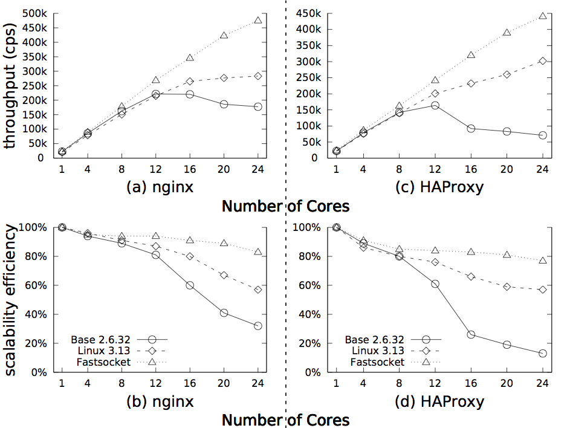
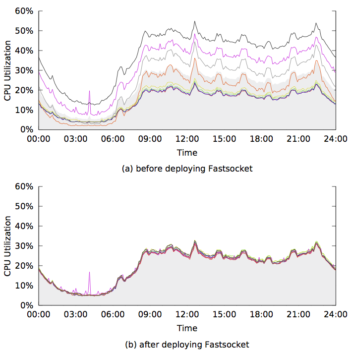

 README for FASTSOCKET
========================================================================

## TABLE OF CONTENT ##
* [Introduction](NEWREADME.md#introduction)
* [Included directory](NEWREADME.md#included-directories)
* [Hardware requisite](NEWREADME.md#hardware-requisite)
* [Installing from source](NEWREADME.md#installing-from-source)
* [Installing from RPM](NEWREADME.md#installing-from-rpm)
* [Making the user library](NEWREADME.md#making-the-user-library)
* [How to use](NEWREADME.md#how-to-use)
* [Running demo](NEWREADME.md#running-demo)
* [Application Performance](NEWREADME.md#application-performance)

## INTRODUCTION ##

Fastsocket is a new scalable TCP socket implementation, with two-side 
connection locality principle and per-core data design, to align all 
stages of packet processing for any given connection onto the same core,
to avoid lock contentions, and to keep generality.

## INCLUDED DIRECTORIES ##

* fastsocket - the fastsocket source code directory
* fastsocket/kernel - the kernel source code customized for fastsocket
* fastsocket/library - the library to enable fastsocket in user space
* fastsocket/scripts - some configuration scripts
* fastsocket/demo - the source code directory of a demo server

## HARDWARE REQUISITE ##

We recommend hosts with specific hardwares, to let fastsocket function 
adequately. The most essential requisite is a 10 Gbe Controller.

Here is a list of supported NICs (Network Interface Controller):

- Intel Corporation 82599EB 10-Gigabit SFI/SFP+ Network Connection (ixgbe, igb, bnx2)

## INSTALLING FROM SOURCE ##

Developers can easily get the source codes and build fastsocket as 
prefered. To build and install fastsocket from source, please follow a
few steps.

Install required packages:

	# yum install gcc make ncurses ncurses-devel perl
	# yum update

Get the fastsocket-customized kernel source:

	# git clone http://xxx.xxx.xxx fastsocket

Compile the kernel:

	# cd fastsocket
	# make
	# make modules_install
	# make install

Reboot and enter the new kernel:

	# reboot

## INSTALLING FROM RPM ##

For those who do not want to bother with the source codes, RPM releases
are provided.

Downlaod the RPM files:

	# wget http://xxx.xxx.xxx/xxx.tar
	# tar xf xxx.tar

Install from RPM file:

	# rpm --force -ivh \
	> kernel-2.6.32-431.17.1.el6.x86_64.rpm \ 
	> kernel-firmware-2.6.32-431.17.1.el6.x86_64.rpm \ 
	> kernel-devel-2.6.32-431.17.1.el6.x86_64.rpm

Reboot and enter the new kernel:

	# reboot

## MAKING THE USER LIBRARY ##

The fastsocket user library enables applicaiton to run with the function 
of fastsocket.

To compile the library, enter the library directory, and make:

	# cd fastsocket/library
	# make

After that, a file named libsocket.so is created.

## HOW TO USE ##

Boot into the kernel with fastsocket

Add the fastsocket module into the kernel:

	# modprobe fastsocket \
	> enable_listen_spawn=2 \
	> enable_fast_epoll=1 \
	> enable_receive_flow_deliver=1

   The above command goes with three options - enable_listen_spawn, 
   enable_fast_epool, enable_receive_flow_deliver, which are the
   recommended options.

   To check if the module is loaded normally, run

	# lsmod | grep fastsocket

   and you can see it.

Configure the RSS queue, for example, if 12 queues are used:

	# modprobe ixgbe InterruptThrottleRate=3000 RSS=12

> NOTICE:
> - in this case, the host should have at least 12 processors.
> - to use more than 16 queues, more than one NIC is needed, and the configuration command is:
>
>	`# modprobe ixgbe InterruptThrottleRate=3000,3000 RSS=12,12`

Set up IPs for the NIC, and bind each queue to one certain processor

	# ./nic.sh

Run the application with fastsocket enabled. For example, run ngnix
   with fastsocket with:
 
	# LD_PRELOAD=./libsocket.so nginx

## RUNNING DEMO ##

The demo server can act as a naive server or a proxy server. The former
needs two hosts and the latter three. For more details on the demo server 
please refer to [Demo Server](http://github.com).

### Naive Demo Mode ###

In the naive demo mode, two hosts are needed:

- Host A - a work load producer
- Host B - a naive server

To run the demo, here are the steps on each of two hosts.

**Host A**:

> - Make sure the host is booted with the fastsocket kernel
> - Load the module into kernel and complete configurations in [How To Use](NEWREADME.md#how-to-use).
> - Run the work load, here with 12 tasks:
>
>	`# ./http_load.sh 12`

**Host B**:

> - Make sure the host is booted with the fastsocket kernel
> - Load the module into kernel and complete configurations in [How To Use](NEWREADME.md#how-to-use).
> - Make the demo server
>
>	`# cd demo && make`
>
> - Run the demo server with fastsocket
>
>	`# LD_PRELOAD=./libsocket.so ./server`
>

### Proxy Demo Mode ###

In the proxy demo mode, three hosts are needed:

- Host A - a work load producer
- Host B - a proxy server
- Host C - a backend server

To run the demo, here are the steps on each of two hosts.

**Host A**:

> - Make sure the host is booted with the fastsocket kernel
> - Load the module into kernel and complete configurations in [How To Use](NEWREADME.md#how-to-use).
> - Run the work load, here with 12 tasks:
>
>	`# ./http_load.sh 12`
>

**Host B**:

> - Make sure the host is booted with the fastsocket kernel
> - Load the module into kernel and complete configurations in [How To Use](NEWREADME.md#how-to-use).
> - Make the demo server
>
>	`# cd demo && make`
>
> - Run the demo server with fastsocket
>
>	`# LD_PRELOAD=./libsocket.so ./server`
>

**Host C**:

> - Make sure the host is booted with the fastsocket kernel
> - Load the module into kernel and complete configurations in [How To Use](NEWREADME.md#how-to-use).
> - Make the demo server
>
>	`# cd demo && make`
>
> - Run the demo server with fastsocket
>
>	`# LD_PRELOAD=./libsocket.so ./server`
>

## Application Performance ##

For Nginx, 

- HTTP Keep-alive is disabled on Nginx for a short connection test.
- Http load fetches a 64 bytes static file from Nginx with a concurrency of 500 multiplied by the number of cores.
- We enable memory cache for that static file in order to rule out any disk affection.
- Rewriting rules from real world applictions are added.
- Accept mutex is disabled.

Fastsocket on Linux 2.6.32 achieves 470K connection per second and 83% efficiency up to 24 cores, while performance of base 2.6.32 kernel increases non-linearly up to 12 cores and drops dramatically to 159K with 24 cores. The latest 3.13 kernel doubles the throughput to 283K when using 24 cores compared with 2.6.32. However, it has not completely solve the scalability bottlenecks, preventing performance from growing when more than 12 cores are used.

For HAProxy,

- RFD in Fastsocket is required.
- A client runs http load with a concurrency of 500 multiplied by number of cores.
- A back-end server responds each incoming HTTP request with a constant page.

Fastsocket outperforms Linux 3.13 by 14K connection per second and base 2.6.32 by 37K when using 24 cores, though the one core throughputs are very close among all the three kernels.

Fastsocket is deployed on servers running HAProxy in Sina Weibo production system. Here's  the CPU utilization of two servers handling the same amount of requests, one is with Fastsocket and the other is not.

